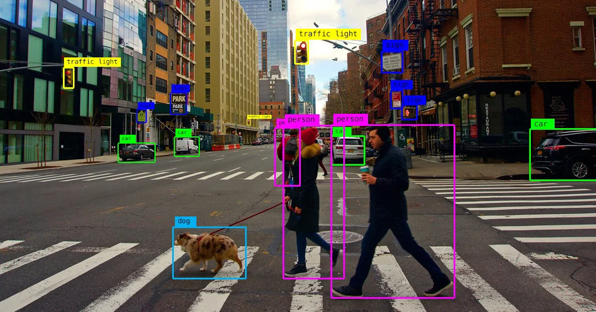

# OpenCV-Tutorials




This all Chapter to leran opencv with python
[link Video YT](https://youtu.be/WQeoO7MI0Bs)

for install opencv with python
```bash
pip install opencv-python
```

and import opencv in python

```python
import cv2
import numpy as np
```

<hr>
<h3>For install this Tutorial</h3>
Go to your terminal and type this command

```cmd
    cd Desktop

    mkdir OpenCV-Tutorials

    cd OpenCV-Tutorials
```

```bash
    git clone 'url up'
```

<hr>


## Chapter 1: Getting Started with Images
    * Read an image
    * Display an image
    * Read a Video
    * Read a webcam
    * save an image
    

[Chapter 1](Chapter1.py)


## Chapter 2: Basic Operations on Images
    * Gray image
    * Color image
    * Blur image
    * Canny image
    * Dialation image
    * Eroded image
[Chapter 2](Chapter2.py)

## Chapter 3: Resizing and Cropping and Rotation
    * Resize image
    * Crop image
    * Rotation image
[Chapter 3](Chapter3.py)

## Chapter 4: Shapes and Texts
    * Line
    * Rectangle
    * Circle
    * Text
[Chapter 4](Chapter4.py)

## Chapter5 : WARP PRESPECTIVE
    * Warp Perspective

[Chapter 5](Chapter5.py)

## Chapter6 : Joining Images
    * Joining Images
    * Horizontal Stacking
    * Vertical Stacking

[Chapter 6](Chapter6.py)

## Chapter7: Color Detection
    * Color Detection
    * Trackbars
    * Color Detection using Trackbars

[Chapter 7](Chapter7.py)

## Chapter8: CONTOURS / SHAPE DETECTION
    * Contours
    * Shape Detection
    * Stacking Images and Contour Detection
[Chapter 8](Chapter8.py)


### Projects:

1. Face and Eye Detection 
[Project 1](Project1.py)